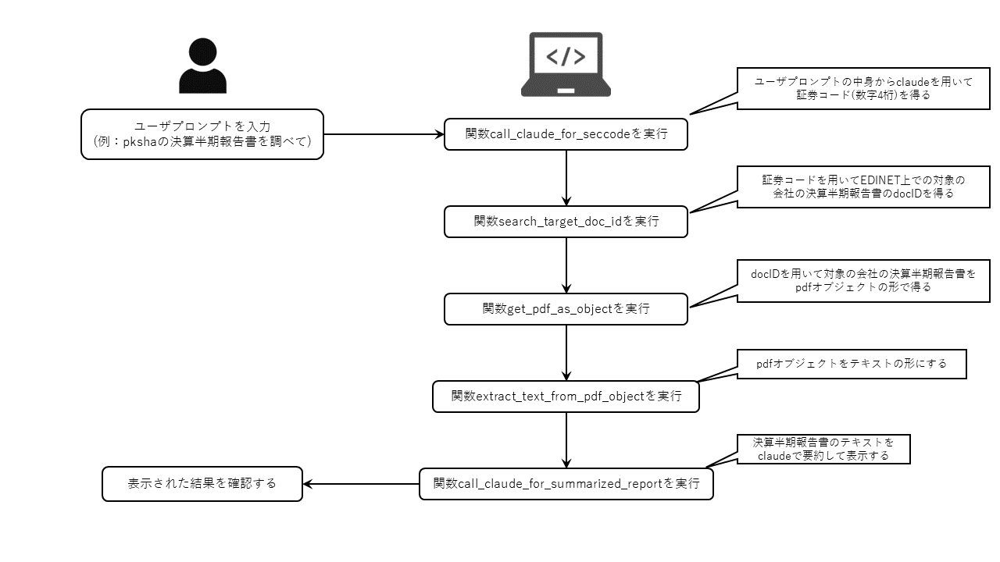
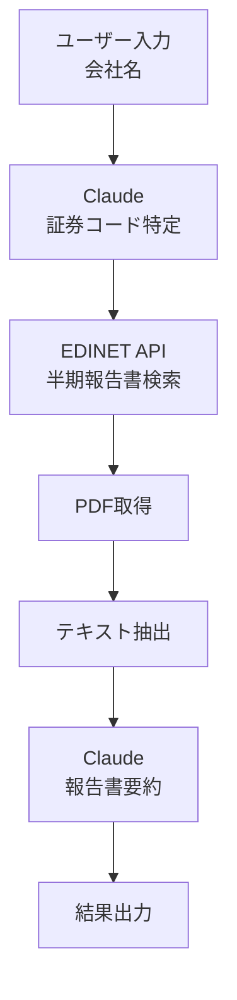
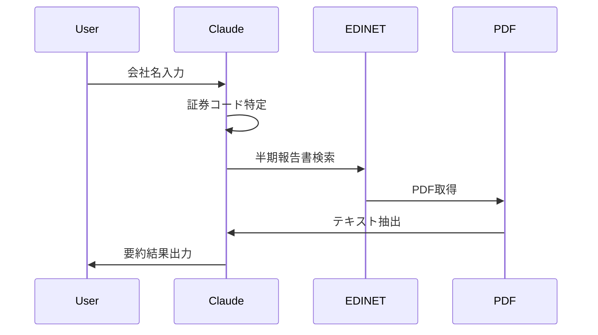

# このフォルダのプログラムについて

このフォルダのmainプログラム(main.ipynb)は、LLMアプリ的なものを作ってみようと思って作成してみたものになります。

## 概要

このmainプログラム(main.ipynb)は、ユーザプロンプトに決算半期報告書を確認したい旨を会社名も含めて入力する事で、
その会社の決算半期報告書をEDINETから取得して、その内容をLLMで要約してその結果を表示します。

以下に、mainプログラムの概要図と処理フローを示す図を掲載します。

# EDINETデータ取得・分析プログラム
証券コード検索から半期報告書の要約までを自動化

---

# プログラムの主な機能

1. 会社名から証券コードの特定
2. EDINETからの半期報告書PDF取得
3. PDFからのテキスト抽出
4. Claude (Bedrock)による報告書の要約

---

# システム構成図

---

# 主要な関数の説明

- `call_claude_for_seccode()`: 会社名から証券コードを取得
- `search_target_doc_id()`: EDINETで半期報告書を検索
- `get_pdf_as_object()`: PDFファイルを取得
- `extract_text_from_pdf_object()`: PDFからテキストを抽出
- `call_claude_for_summarized_report()`: 報告書の要約を生成

---

# 使用している主なライブラリ/API

- **AWS Bedrock**: Claude AIモデルの利用
- **EDINET API**: 企業の開示書類取得
- **PyMuPDF (fitz)**: PDF処理
- **boto3**: AWS SDK
- **requests**: HTTP通信
- **dotenv**: 環境変数管理

---

# 処理フロー詳細

