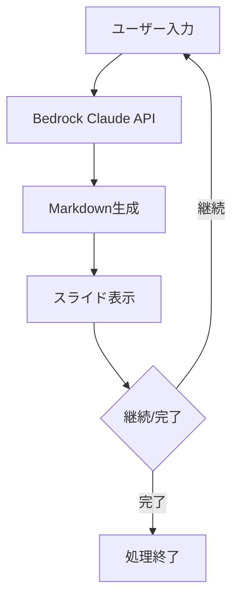

# このフォルダのプログラムについて

このフォルダのmainプログラム(main.ipynb)は、LLM(AWS Bedrockのclaude 3.5 sonnet)を使って、対象のプログラムの内容をスライド形式のMarpで表現、出力するものになります。 
(boto3バージョン 1.40.21)

# Bedrock Claudeを用いた対話型スライド生成プログラム

---

## プログラムの概要

- Bedrock Claude APIを使用した対話型のスライド生成プログラム
- ユーザーとの対話を通じてMarkdownスライドを段階的に改善
- IPython/Jupyter環境での実行を前提とした設計

---

## システム構成

---

## 主要コンポーネント

1. **環境設定**
   - dotenvによる環境変数の読み込み
   - Bedrock Claudeのクライアント初期化
   - ツール仕様の定義

2. **ツール定義**
   - Markdown生成ツール
   - 完了処理ツール

---

## 処理フロー詳細

1. ターゲットコードの読み込み
2. Claude APIへのリクエスト送信
3. レスポンスからMarkdownコンテンツの抽出
4. IPython.displayによるMarkdownのレンダリング
5. ユーザーからの追加入力受付
6. 処理の継続または完了

---

## 技術スタック

- **AWS Bedrock**: Claude APIの利用
- **boto3**: AWS SDK
- **IPython**: Markdownレンダリング
- **python-dotenv**: 環境変数管理
