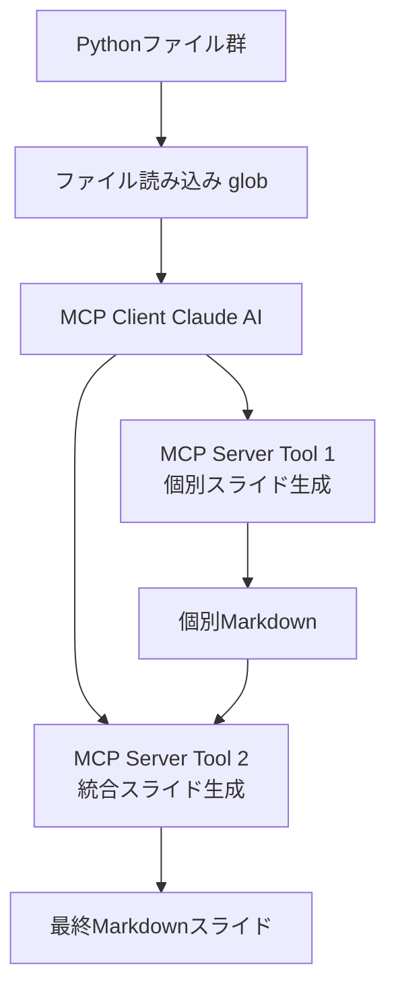
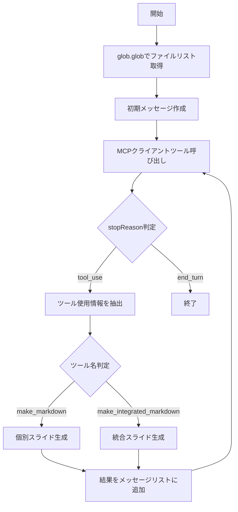
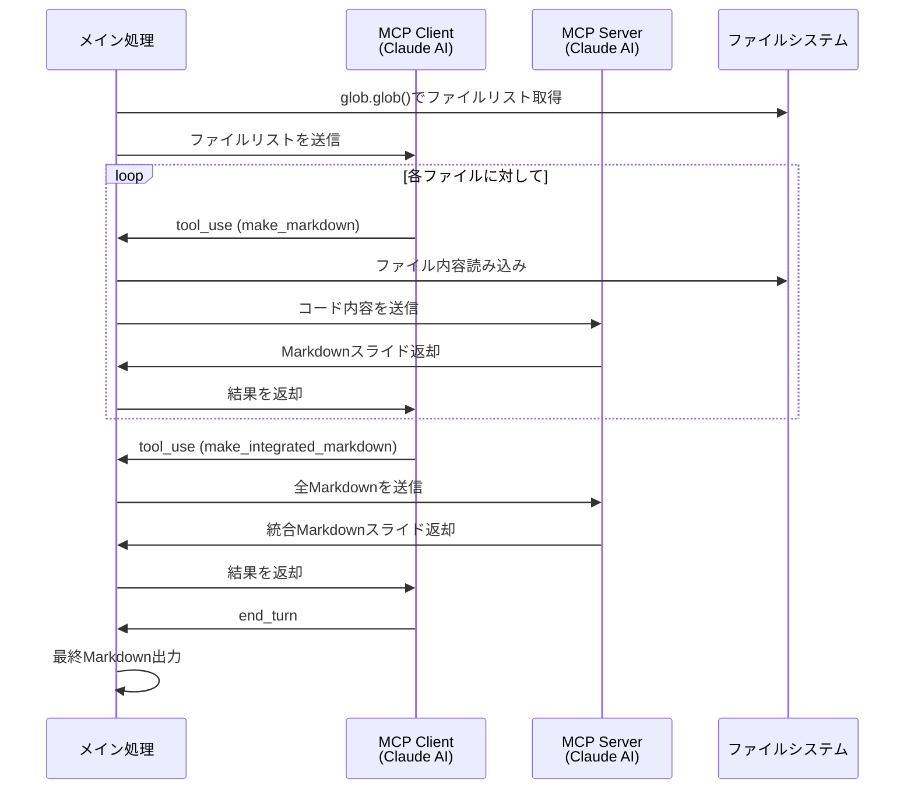
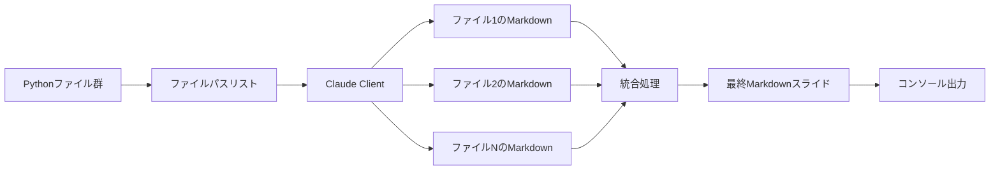

# このフォルダのプログラムについて

このフォルダのmainプログラム(main.ipynb)は、LLM(AWS Bedrockのclaude 4.5 sonnet)を使って、複数のpythonファイルの内容を踏まえて、それらの内容を纏めた形のスライドをMarpで表現、出力するものになります。 
(boto3バージョン 1.40.21)

# Claude AIを活用したスライド自動生成システム

---

## システムアーキテクチャ

---

## ツール定義構造

**MCPクライアントツール**

1. input_data_for_mcp_server_tool_to_make_markdown
   - 個別プログラムファイルのパスを受け取る
   - 各ファイルのMarkdownスライドを生成

2. input_data_for_mcp_server_tool_to_make_integrated_markdown
   - 複数のMarkdownを統合
   - 1つの統合されたスライドを作成

---

## ツール定義構造

**MCPサーバーツール**

1. mcp_server_tool_to_make_markdown
   - プログラムの概要を説明するスライドをMarkdownで作成

2. mcp_server_tool_to_make_integrated_markdown
   - 複数のMarkdownを分かりやすい形に再構成

---

## 処理フロー全体像

---

# シーケンス図

---

## データフロー

---

## 主要な技術要素

| 要素 | 説明 |
|------|------|
| **AWS Bedrock** | Claude AIモデルへのアクセス |
| **Claude AI** | コード解析とMarkdown生成 |
| **MCP (Model Context Protocol)** | クライアント・サーバー型のツール連携 |
| **Tool Use** | Claude AIのツール呼び出し機能 |
| **Marp** | Markdownからスライド生成 |

---

## プログラムの特徴

1. **階層的なAI活用**
   - MCPクライアント: プロジェクト全体の管理
   - MCPサーバー: 個別タスクの実行

2. **反復的な処理**
   - while loopでClaude AIとの対話を継続
   - tool_useとend_turnで処理フローを制御

3. **柔軟な拡張性**
   - ツール定義を動的に生成
   - 新しいツールの追加が容易

---

## まとめ

このプログラムは以下を実現します:

✅ Claude AIによる内容理解と説明生成 
✅ 複数スライドの統合と最適化 
✅ Marp形式のMarkdown出力 

**結果:** 複数プログラムを説明する包括的なスライド資料が自動生成される
